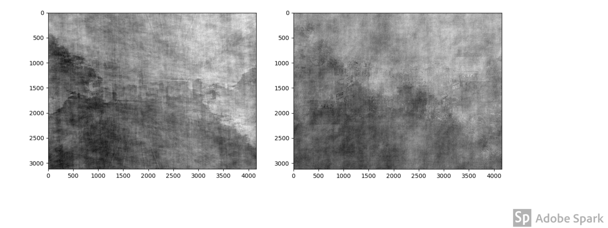

# Fourier transform on images

The objective was to see how Fourier transform can be used on images to get useful information about images that can be used for various image processing purposes.

## Phase swapping 

To swap the phase information of images, we use Fourier transform to calculate the magnitude and phase of each image, the magnitude of one image is multiplied with the phase of other image.
Inverse Fourier transform is then performed on this result so that results of this phase swapping on both the images can be displayed as images.

The original images are- 

  

After swapping the phases, the images look like-

  

