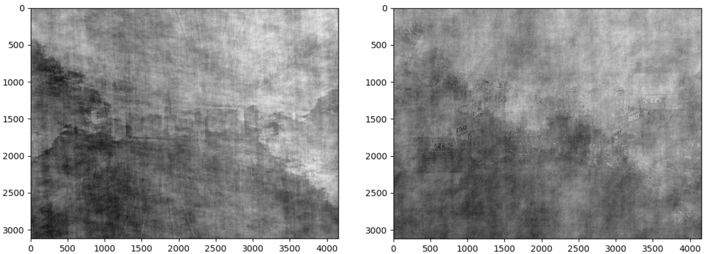
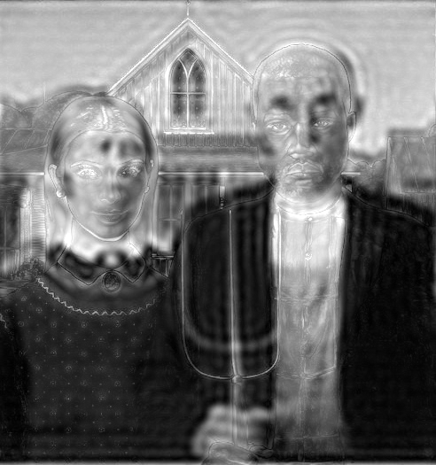

# Fourier transform on images

The objective was to see how Fourier transform can be used on images to get useful information about them that can be used for various image processing purposes.

## Phase swapping 

To swap the phase information of images, we use Fourier transform to calculate the magnitude and phase of each image, the magnitude of one image is multiplied with the phase of other image.
Inverse Fourier transform is then performed on this result so that results of this phase swapping on both the images can be displayed as images.

The original images are- 

  

After swapping the phases, the images look like-

  
  The left image here contains the phase of original right image and vice versa for the right image here.

From these results it can be said that phase information contains the location of the features as we can partially the rail tracks in the left image of the result and very little 
information of the original image on the left. Similarly, we can see the 'Stanley' hoarding in the right image of the result which was originally present in the left image. 

## Hybrid images

The results given in the paper ['Hybrid images'](https://stanford.edu/class/ee367/reading/OlivaTorralb_Hybrid_Siggraph06.pdf) have been tried to be replicated. 

The low frequencies of one images are combined with the high frequencies of the other image.

The original two images are-

  

After combiing the two images the result is-

  

